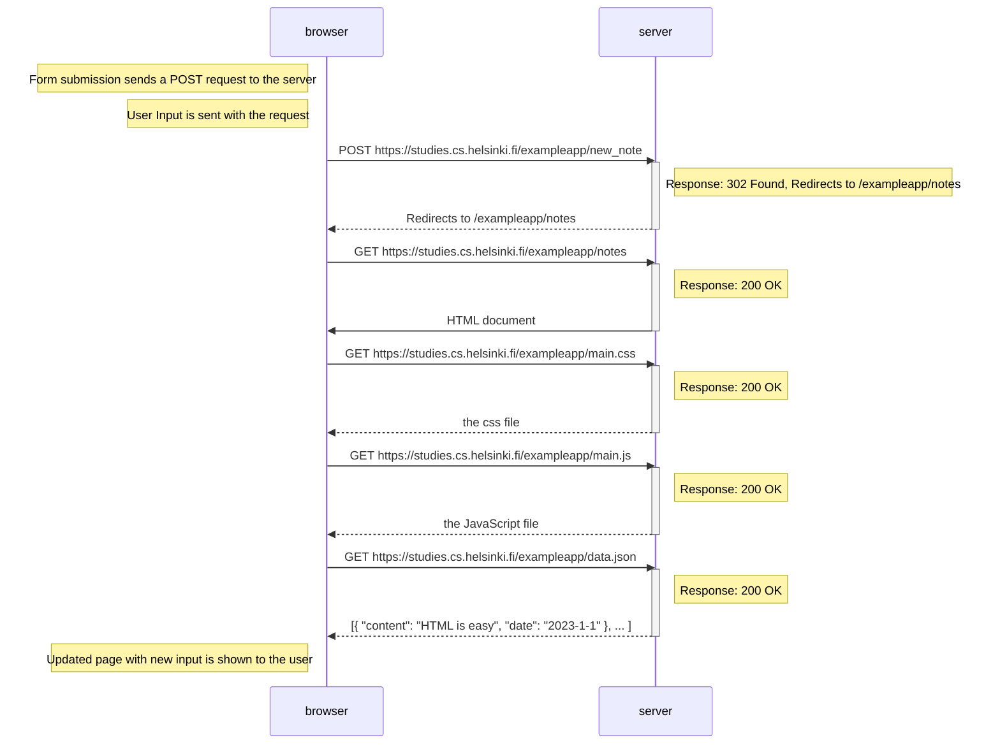

```mermaid
sequenceDiagram
    participant browser
    participant server

    Note left of browser: Form submission sends a POST request to the server
    Note left of browser: User Input is sent with the request

    browser->>server: POST https://studies.cs.helsinki.fi/exampleapp/new_note
    activate server
    Note right of server: Response: 302 Found, Redirects to /exampleapp/notes
    server-->>browser: Redirects to /exampleapp/notes
    deactivate server

    browser->>server: GET https://studies.cs.helsinki.fi/exampleapp/notes
    activate server
    Note right of server: Response: 200 OK
    server->>browser: HTML document
    deactivate server

    browser->>server: GET https://studies.cs.helsinki.fi/exampleapp/main.css
    activate server
    Note right of server: Response: 200 OK
    server-->>browser: the css file
    deactivate server

    browser->>server: GET https://studies.cs.helsinki.fi/exampleapp/main.js
    activate server
    Note right of server: Response: 200 OK
    server-->>browser: the JavaScript file
    deactivate server

    browser->>server: GET https://studies.cs.helsinki.fi/exampleapp/data.json
    activate server
    Note right of server: Response: 200 OK
    server-->>browser: [{ "content": "HTML is easy", "date": "2023-1-1" }, ... ]
    deactivate server

    Note left of browser: Updated page with new input is shown to the user

```
